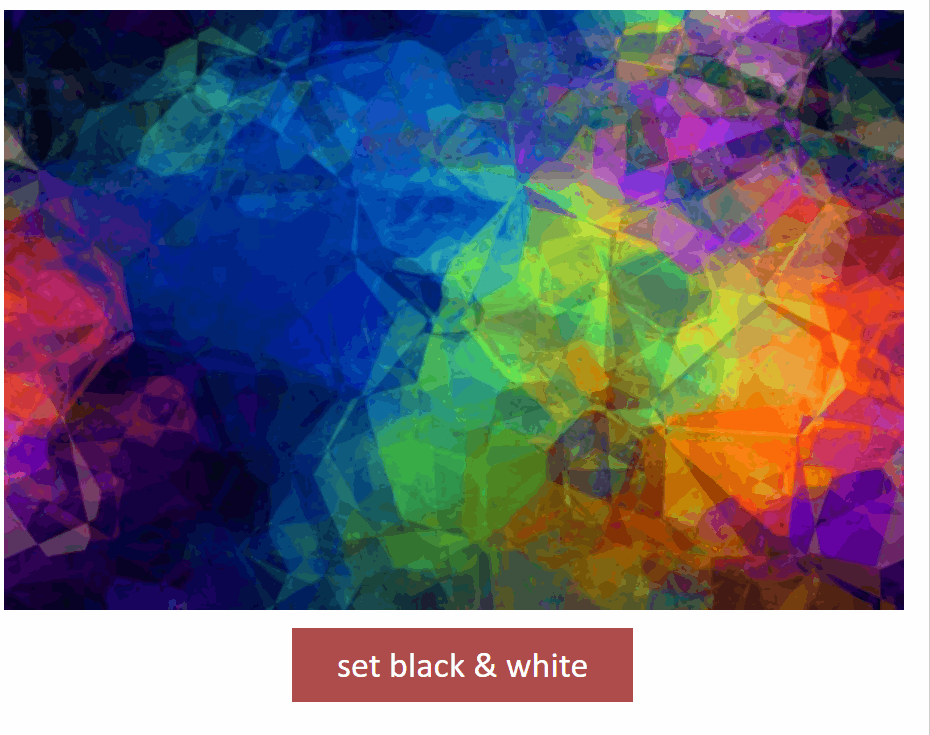

# ComputerGraphics labs
Laboratory works on computer graphics [5 semester]

# Laboratory work №1
Tasks:
 - [X] realise trajectory movement
 - [X] draw something
## Task_1 - Realise trajectory movement
 > 1.1 - Sinusoidal motion:
 
 > 1.2 - Lissajous figures
 
 > 1.3 - Сircular motion 

## Task_2 - Draw something
 > Home 

# Laboratory work №2

